# 2025年12月待办清单

## 2025年12月7日：

- [x] 1. 学习 Milvus 数据库基础概念（如`auto_id`, `dynamic_field`）。
- [x] 2. 梳理 Milvus 中 ANN 与 KNN 的区别与应用。
    - [笔记归档](Knowledge-Base/Milvus/ANN与KNN详解.md)

## 2025年12月8日：

- [x] 1. 学习使用 Markdown 的折叠语法。
- [x] 2. 学习项目 `steins-rag` 中 Milvus Schema 的创建方法。
    - [笔记归档](Knowledge-Base/Milvus/Schema与Function详解.md)
- [ ] 3. 学习项目 `steins-rag` 中 `Function` 与 `add_function()` 的用法。

## 2025年12月9日：

- [x] 1. 学习并记录在 Linux 上卸载软件并清除所有配置文件的方法。
    - [笔记归档](Knowledge-Base/Linux/软件安装与卸载指南.md)

## 2025年12月11日：

- [x] 1. 学习 Python 的 `@dataclass` 装饰器。
    - [笔记归档](Knowledge-Base/Python/Dataclass详解.md)
- [x] 2. 记录在 Windows 环境下安装 Gemini CLI 的步骤。
    - [笔记归档](Knowledge-Base/CLI/Windows下安装Gemini-CLI.md)

## 2025年12月12日：

- [x] 1. 优化观韬 RAG 助手的提示词。
    - [笔记归档](Knowledge-Base/Prompt-Engineering/观韬RAG助手提示词.md)
- [x] 2. 学习GitHub 仓库的分支命名规范与类型。
	- [笔记归档](Knowledge-Base/Github/GitHub仓库分支命名规范.md)

```mermaid
graph TD
    subgraph "数据注入流程 (Ingestion)"
        direction LR
        A[原始文件 .g. PDF, DOCX] --> B{解析与分块<br/>/internal/parser<br/>/internal/splitter};
        B --> C[创建异步嵌入任务<br/>/app/services/task_manager];
        C --> D((Redis<br/>任务队列));
        E[Embedding Worker] --> D;
        D --> E;
        E --> F{生成向量<br/>Embedding Model};
        F --> G((Milvus<br/>向量数据库));
    end

    subgraph "检索生成流程 (Retrieval)"
        direction LR
        H[用户查询 Query] --> I{API Endpoint<br/>/api/v1/retrieve};
        I --> J[生成查询向量];
        J --> K((Milvus<br/>向量数据库));
        K --> L[检索相关文档块];
        L --> M{构建 Prompt};
        M --> N[大语言模型<br/>LLM];
        N --> O[生成答案];
        O --> H;
    end

    H -- HTTPS Request --> I;
    I -- Business Logic --> J;
    C -- Push Task --> D;
    E -- Fetch Task --> D;
    F -- Store Vector --> G;
    J -- Search Vector --> K;
    O -- HTTPS Response --> H;
    A -- /api/v1/upsert --> B;

```

