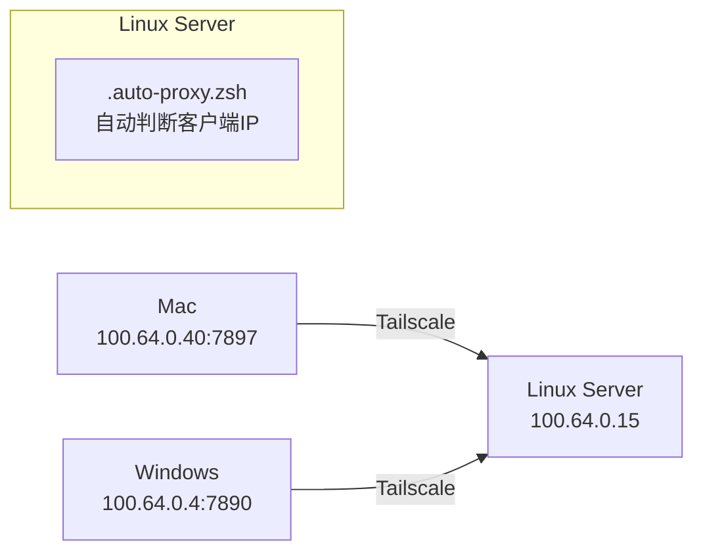

# VS Code / Codex 多设备远程开发：自动代理与排错笔记

## 1. 我的环境与目标

我有两台客户端，通过 Tailscale 连接同一台 Linux 开发服务器：

| 设备           | Tailscale IP  | 本地代理               |
| ------------ | ------------- | ------------------ |
| MacBook      | `100.64.0.40` | Clash Verge `7897` |
| Windows      | `100.64.0.4`  | 代理 `7890`          |
| Linux Server | `100.64.0.15` | —                  |

我的目标是：

```text
Mac 连接服务器
→ Server 自动使用 Mac 的代理 100.64.0.40:7897

Windows 连接服务器
→ Server 自动使用 Windows 的代理 100.64.0.4:7890
```

并且同时兼容：

```text
Terminal / CMD
VS Code Remote SSH
Codex Remote
Claude Remote
...
```

最终希望做到：

> 客户端只负责表明“我是谁”，服务器自动选择对应代理。

---

# 2. 最终架构

整体链路：

```text
Mac(100.64.0.40:7897)
       │ Tailscale
       ▼
Linux Server(100.64.0.15)
       │ 内部运行 .auto-proxy.zsh（自动识别客户端）
       ▲
       │ Tailscale
Windows(100.64.0.4:7890)

```


服务器最终设置：

```text
Mac:
http_proxy=http://100.64.0.40:7897

Windows:
http_proxy=http://100.64.0.4:7890
```

这里没有额外 SSH 端口转发。

---

# 3. 为什么不能只依赖 `$SSH_CLIENT`

普通 SSH：

```bash
ssh steins-workspace
```

服务器通常可以通过：

```bash
echo $SSH_CLIENT
```

看到实际客户端，例如：

```text
100.64.0.40 57268 22
```

因此 Terminal / CMD 场景可以直接根据 IP 判断：

```text
100.64.0.40 → Mac
100.64.0.4  → Windows
...
```

但是 VS Code Remote SSH 比普通 SSH 多了一层长期存在的远程服务：

```text
Local VS Code
      │
      │ SSH
      ▼
Linux Server
      │
      └── VS Code Server
              │
              ├── Extension Host
              │
              └── Terminal
                     └── zsh
```

VS Code Server、终端恢复以及长期存在的后台进程，会让：

```text
“当前这个 Terminal 属于哪台客户端”
```

和：

```text
“最初启动父进程的是哪条 SSH 连接”
```

不一定始终是一回事。

因此：

> 普通 SSH 可以优先使用 `$SSH_CLIENT`；VS Code 集成终端最好显式告诉服务器当前客户端是哪台机器。

---

# 4. VS Code 显式注入客户端身份

Mac VS Code：

```json
"terminal.integrated.env.linux": {
    "VSCODE_CLIENT_DEV": "mac"
}
```

Windows VS Code：

```json
"terminal.integrated.env.linux": {
    "VSCODE_CLIENT_DEV": "win"
}
```

服务器因此可以优先判断：

```text
VSCODE_CLIENT_DEV=mac
→ Mac

VSCODE_CLIENT_DEV=win
→ Windows
```

没有这个变量时，再回退到：

```bash
$SSH_CLIENT
```

这样形成两级判断：

```text
VS Code
   ↓
VSCODE_CLIENT_DEV
   ↓
优先判断客户端

普通 SSH
   ↓
SSH_CLIENT
   ↓
回退判断客户端
```

需要注意：

> `terminal.integrated.env.linux` 主要影响 VS Code 的集成终端，不应该把它理解成“给所有 VS Code Remote 后台进程注入环境变量”。

这是后面排查 Codex 时尤其需要区分的一点。

---

# 5. 自动代理脚本

服务器：

```text
~/.auto-proxy.zsh
```

建议保持逻辑简单：

```zsh
# ==========================================
# 多设备自动代理
# ==========================================

WIN_TS_IP="100.64.0.4"
MAC_TS_IP="100.64.0.40"

WIN_PROXY_PORT=7890
MAC_PROXY_PORT=7897


_set_proxy() {
    local host="$1"
    local port="$2"

    export all_proxy="socks5h://${host}:${port}"
    export ALL_PROXY="${all_proxy}"

    export http_proxy="http://${host}:${port}"
    export HTTP_PROXY="${http_proxy}"

    export https_proxy="http://${host}:${port}"
    export HTTPS_PROXY="${https_proxy}"

    export socks5_proxy="socks5h://${host}:${port}"
}


_clear_proxy() {
    unset all_proxy ALL_PROXY
    unset http_proxy HTTP_PROXY
    unset https_proxy HTTPS_PROXY
    unset socks5_proxy SOCKS5_PROXY
}


auto_proxy_switch() {
    local client_ip
    client_ip=$(echo "${SSH_CLIENT}" | awk '{print $1}')

    export no_proxy="127.0.0.1,localhost,192.168.0.0/16,100.64.0.0/10,.steins.net"
    export NO_PROXY="${no_proxy}"

    # VS Code：Mac
    if [[ "${VSCODE_CLIENT_DEV}" == "mac" ]]; then
        _clear_proxy
        _set_proxy "${MAC_TS_IP}" "${MAC_PROXY_PORT}"
        return
    fi

    # VS Code：Windows
    if [[ "${VSCODE_CLIENT_DEV}" == "win" ]]; then
        _clear_proxy
        _set_proxy "${WIN_TS_IP}" "${WIN_PROXY_PORT}"
        return
    fi

    # 普通 SSH：Windows
    if [[ "${client_ip}" =~ ^192\.168\.3\. ]] || \
       [[ "${client_ip}" == "${WIN_TS_IP}" ]]; then
        _clear_proxy
        _set_proxy "${WIN_TS_IP}" "${WIN_PROXY_PORT}"
        return
    fi

    # 普通 SSH：Mac
    if [[ "${client_ip}" == "${MAC_TS_IP}" ]]; then
        _clear_proxy
        _set_proxy "${MAC_TS_IP}" "${MAC_PROXY_PORT}"
        return
    fi
}

auto_proxy_switch
```

加载：

```zsh
# ~/.zshenv

[ -f ~/.auto-proxy.zsh ] && source ~/.auto-proxy.zsh
```

之前放在：

```text
~/.zshrc
```

后来改到：

```text
~/.zshenv
```

原因是 `.zshrc` 主要针对交互式 zsh，而 `.zshenv` 的覆盖范围更广。

但也因此脚本中最好不要：

```text
一启动 zsh 就无条件清除代理
```

而应该：

> 先判断当前是哪台客户端，识别成功后再修改代理。

---

# 6. 今天遇到的问题：Codex 一直 Reconnecting

今天 Codex Remote SSH 表面上可以连接服务器，但发送消息后不断出现：

```text
Reconnecting... waiting for network
```

一开始容易误以为：

```text
Codex SSH 断了
```

实际上需要把两条链路分开看：

```text
第一条：

Mac
 ↓
SSH
 ↓
Server

第二条：

Server
 ↓
Proxy
 ↓
Mac Clash
 ↓
OpenAI
```

第一条可以完全正常，而第二条失败。

所以：

> “SSH Connected” 不代表远程 Codex 能访问 OpenAI。

---

# 7. 今天真正的根因

服务器当时的代理：

```bash
http_proxy=http://100.64.0.40:7897
https_proxy=http://100.64.0.40:7897
all_proxy=socks5h://100.64.0.40:7897
```

测试：

```bash
curl -I https://api.openai.com/v1/models
```

得到：

```text
Failed to connect to 100.64.0.40 port 7897
```

于是先验证 Tailscale：

```bash
tailscale ping 100.64.0.40
```

正常：

```text
pong from cometmacbookpro
```

说明：

```text
Server → Mac ✅
```

问题进一步缩小到：

```text
Server → Mac:7897 ❌
```

---

# 8. Clash Verge 的关键问题

Mac：

```bash
sudo lsof -nP -iTCP:7897 -sTCP:LISTEN
```

结果：

```text
verge-mihomo ... TCP 127.0.0.1:7897 (LISTEN)
```

而不是：

```text
*:7897
```

这意味着 Clash 只接受：

```text
Mac 自己 → 127.0.0.1:7897
```

但是服务器访问的是：

```text
Server → 100.64.0.40:7897
```

自然连接不上。

这也是本次 Codex：

```text
Reconnecting... waiting for network
```

的核心原因。

---

# 9. 关键经验：代理地址正确，不代表代理可达

以前只关注：

```text
IP 对不对？
端口对不对？
```

这次发现还必须检查：

```text
服务监听在哪个网络接口？
```

例如：

```text
127.0.0.1:7897
```

只代表：

> 本机可以访问。

而：

```text
0.0.0.0:7897
```

或允许对应网络接口访问，才意味着其他设备有机会通过：

```text
100.64.0.40:7897
```

连接。

因此以后遇到类似问题，第一组命令就应该是：

```bash
tailscale ping 100.64.0.40

nc -vz 100.64.0.40 7897
```

Mac：

```bash
sudo lsof -nP -iTCP:7897 -sTCP:LISTEN
```

三个测试分别验证：

```text
机器可达？
↓
端口可达？
↓
服务到底监听在哪里？
```

---

# 10. 曾尝试 SSH RemoteForward

为了绕过 Clash 只监听 localhost 的问题，曾尝试：

```sshconfig
RemoteForward 17897 127.0.0.1:7897
```

链路变成：

```text
Server 127.0.0.1:17897
        │
        │ SSH Tunnel
        ▼
Mac 127.0.0.1:7897
        │
        ▼
Clash
```

测试：

```bash
curl -x http://127.0.0.1:17897 \
  -I https://api.openai.com/v1/models
```

成功得到：

```text
HTTP/1.1 200 Connection established
HTTP/2 401
```

这里的 `401` 是正常结果：

> 没带 OpenAI API Key，所以身份认证失败，但网络链路已经完全打通。

这个实验证明了：

```text
Codex 本身没坏
OpenAI 也能访问

真正坏的是：
Server → Mac Clash
```

---

# 11. RemoteForward 又踩了一个坑

一开始把：

```sshconfig
RemoteForward 17897 127.0.0.1:7897
ExitOnForwardFailure yes
```

直接放到了：

```sshconfig
Host steins-workspace
```

但是 Codex、VS Code、Terminal 都会独立创建 SSH 连接。

第一条连接：

```text
成功占用 Server :17897
```

第二条连接：

```text
再次尝试绑定 :17897
```

结果：

```text
remote port forwarding failed for listen port 17897
```

并且由于：

```sshconfig
ExitOnForwardFailure yes
```

整个 SSH 连接直接被判失败。

Codex 当时的报错：

```text
Authenticated to 100.64.0.15 using "publickey"

Error:
remote port forwarding failed for listen port 17897
```

这句话非常有价值：

```text
Authenticated
```

说明 SSH 密钥认证其实成功了。

真正失败的是：

```text
RemoteForward
```

所以排错时不要只看：

```text
SSH connection failed
```

要继续看**后面的具体错误**。

---

# 12. 为什么最后不使用 RemoteForward

RemoteForward 本身没问题，而且安全隔离更好。

但是如果长期使用，需要：

```text
单独维护一个 SSH Tunnel
```

例如：

```text
steins-workspace
→ VS Code / Codex / Terminal

steins-workspace-proxy
→ 专门维持代理
```

结构会变成：

```text
Mac
│
├── Proxy SSH Tunnel
│
├── VS Code SSH
├── Codex SSH
└── Terminal SSH
```

对于目前这个需求有些复杂。

而原来的 Tailscale 方案：

```text
Server
 ↓
100.64.0.40:7897
 ↓
Mac Clash
```

更直接。

因此最终仍然采用：

> **Tailscale IP + 客户端自动识别 + Clash 对 Tailscale 网络提供代理。**

---

# 13. 原方案真正需要满足的条件

Mac：

```text
100.64.0.40:7897
```

必须从 Server 可达。

Windows：

```text
100.64.0.4:7890
```

也必须从 Server 可达。

因此代理软件不能只监听：

```text
127.0.0.1
```

需要允许来自 Tailscale 的连接。

Clash Verge 中对应：

```text
Allow LAN / 允许局域网连接
```

但需要注意安全性：

> 开启之后不要默认认为只有服务器能访问代理。

最好配合 Tailscale ACL / 防火墙限制来源，只允许可信设备访问代理端口。

---

# 14. VS Code 当前配置

Mac：

```json
{
  "terminal.integrated.env.linux": {
    "VSCODE_CLIENT_DEV": "mac"
  },

  "http.proxySupport": "off",

  "remote.SSH.useLocalServer": false
}
```

其中职责分别是：

```text
VSCODE_CLIENT_DEV
→ 告诉远程 Terminal 当前客户端是 Mac

http.proxySupport
→ 控制 VS Code 自身代理行为

remote.SSH.useLocalServer
→ 控制 Remote SSH 的本地 helper 模式
```

尤其注意：

```text
http.proxySupport = off
```

并不等于：

```text
远程服务器自动获得 Mac 的代理
```

服务器代理仍然由：

```text
~/.auto-proxy.zsh
```

负责。

---

# 15. 一套固定排障流程

以后再出现：

```text
SSH 正常
但 Codex / curl / git 无法访问外网
```

不要先改一堆配置。

按下面顺序排：

```text
① SSH 是否正常？

ssh steins-workspace


② 当前识别的是谁？

echo $VSCODE_CLIENT_DEV
echo $SSH_CLIENT


③ 当前代理是什么？

env | grep -i proxy


④ Server 能否找到客户端？

tailscale ping 100.64.0.40


⑤ Server 能否访问代理端口？

nc -vz 100.64.0.40 7897


⑥ 客户端代理监听在哪里？

sudo lsof -nP -iTCP:7897 -sTCP:LISTEN


⑦ 强制指定代理测试

curl -x http://100.64.0.40:7897 \
  -I https://api.openai.com/v1/models


⑧ 最后才测试应用

codex
git
pip
uv
```

这条排障链非常重要：

```text
SSH
↓
设备识别
↓
环境变量
↓
Tailscale
↓
TCP Port
↓
Proxy
↓
Internet
↓
Codex
```

不要一看到：

```text
Codex Reconnecting
```

就直接从 Codex 开始查。

---

# 16. VS Code Server 的清理

遇到：

```text
Remote 环境变量异常
Terminal 恢复了旧环境
扩展宿主异常
VS Code Server 状态异常
```

优先使用：

```text
Command Palette
→ Remote-SSH: Kill VS Code Server on Host...
```

然后完全退出 VS Code 再重新连接。

命令行也可以查看：

```bash
ps aux | grep vscode
```

必要时：

```bash
pkill -f vscode-server
```

只有确认 Server 安装本身损坏时，才考虑：

```bash
rm -rf ~/.vscode-server
```

因为这会导致 Remote Server 和部分远程扩展重新安装，不应该作为日常第一排障手段。

---

# 17. 本次最重要的几个经验

**经验 1：SSH 通，不代表应用层网络通。**

```text
Mac → Server
```

和：

```text
Server → OpenAI
```

是两条不同链路。

---

**经验 2：IP 能 ping 通，不代表端口能访问。**

这次：

```text
tailscale ping 100.64.0.40 ✅

100.64.0.40:7897 ❌
```

最终原因就是 Clash 只监听：

```text
127.0.0.1:7897
```

---

**经验 3：先验证最底层，再怀疑应用。**

最有价值的几个命令：

```bash
tailscale ping
nc -vz
lsof
curl -x
env
```

远比一开始重装 Codex / VS Code 更有效。

---

**经验 4：错误标题不一定是真正原因。**

Codex：

```text
SSH connection failed
```

但真正日志是：

```text
Authenticated successfully

remote port forwarding failed
```

说明：

```text
Authentication ✅
Port Forward ❌
```

读完整日志比看 UI 标题重要。

---

**经验 5：不要为了修一个局部问题过度增加架构复杂度。**

今天为了绕过 Clash localhost 限制，一度引入：

```text
RemoteForward
独立 Host
专用 SSH Tunnel
launchd
```

这些方案技术上成立，但对于当前需求不一定必要。

真正的问题只是：

```text
Clash 没有允许 Server 访问 7897
```

因此先修最小问题，往往比重新设计整套链路更合理。

---

# 18. 当前最终方案

最终保持：

```text
Mac
Tailscale 100.64.0.40
Clash :7897
       │
       │
       ▼
Server 100.64.0.15

.auto-proxy.zsh：

VS Code Mac
→ VSCODE_CLIENT_DEV=mac
→ 100.64.0.40:7897

VS Code Windows
→ VSCODE_CLIENT_DEV=win
→ 100.64.0.4:7890

普通 SSH
→ SSH_CLIENT
→ 自动判断 Mac / Windows
```

而：

```text
RemoteForward
steins-workspace-proxy
17897
```

全部不作为最终架构的一部分。

最终原则可以压缩成一句话：

> **客户端负责声明身份，服务器负责选择代理，Tailscale 负责设备互通，代理软件负责真正提供可达的代理端口。**

这比把“身份识别、SSH 隧道、代理转发”全部耦合到一条 SSH Connection 里更容易维护。